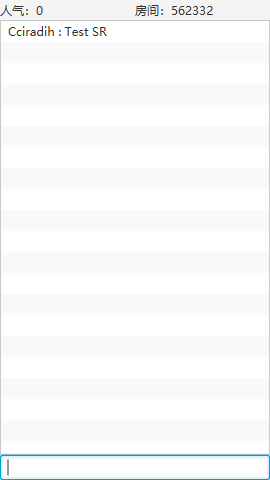

= Bilibili 应用程序接口分析

:author: Cciradih
:email: <mountain@cciradih.top>
:sectanchors:
:sectlinks:
:sectnums:
:sectnumlevels: 5
:toc:
:toc-title: 目录
:toclevels: 5
:appendix-caption: 附录
:source-highlighter: highlightjs

部分资料来自于网络。

[abstract]
== 摘要

Bilibili 应用程序接口分析，包括用户信息、二维码登录和直播弹幕收发。

[preface]
== 前言

由于作者更习惯于文字沟通，但官方直播姬并没有提供一个主播发送弹幕的功能，这是这个项目创立的初衷。本文忽略部分程序的具体实现，着重分析如何与 Bilibili 交互。

当然本仓库本身即可编译运行，主要界面如下：

[glossary]
== 术语

有效 Cookie

SESSDATA:: 登录认证数据
bili_jct:: CSRF 令牌

== 用户

=== 获取信息

[.lead]
判断 SESSDATA 是否有效。

|===
| 请求方式 | GET
| 请求地址 | https://api.live.bilibili.com/xlive/web-ucenter/user/get_user_info
| Cookie | SESSDATA
|===

.Http.class
[source,java]
----
class Http {
    JSONObject checkLogin(String cookie) {
        HttpRequest httpRequest = HTTP_REQUEST_BUILDER
                .GET()
                .uri(URI.create("https://api.live.bilibili.com/xlive/web-ucenter/user/get_user_info"))
                .header("Cookie", cookie)
                .build();
        try {
            return JSON.parseObject(HTTP_CLIENT.send(httpRequest, HttpResponse.BodyHandlers.ofString()).body());
        } catch (IOException | InterruptedException e) {
            System.err.println(e.getMessage());
            return null;
        }
    }
}
----

=== 二维码登录

==== 获取地址

[.lead]
获取的地址用于生成二维码；获取的 oauthKey 在后面用来轮询请求是否登录成功。

|===
| 请求方式 | GET
| 请求地址 | https://passport.bilibili.com/qrcode/getLoginUrl
|===

.Http.class
[source,java]
----
class Http {
    JSONObject getLoginUrl() {
        HttpRequest httpRequest = HTTP_REQUEST_BUILDER
                .GET()
                .uri(URI.create("https://passport.bilibili.com/qrcode/getLoginUrl"))
                .build();
        try {
            return JSON.parseObject(HTTP_CLIENT.send(httpRequest, HttpResponse.BodyHandlers.ofString()).body());
        } catch (IOException | InterruptedException e) {
            System.err.println(e.getMessage());
            return null;
        }
    }
}
----

==== 获取信息

[.lead]
使用前面获取的 oauthKey 请求是否登录成功，如果成功会得到一个地址，而这个地址里包含了有效 Cookie。

|===
| 请求方式 | POST
| 请求地址 | https://passport.bilibili.com/qrcode/getLoginInfo
| Content-Type | application/x-www-form-urlencoded; charset=UTF-8
| Body | oauthKey={oauthKey}
|===

.Http.class
[source,java]
----
class Http {
    JSONObject getLoginInfo(String oauthKey) {
        HttpRequest httpRequest = HTTP_REQUEST_BUILDER
                .POST(HttpRequest.BodyPublishers.ofString("oauthKey=" + oauthKey))
                .uri(URI.create("https://passport.bilibili.com/qrcode/getLoginInfo"))
                .header("Content-Type", "application/x-www-form-urlencoded; charset=UTF-8")
                .build();
        try {
            return JSON.parseObject(HTTP_CLIENT.send(httpRequest, HttpResponse.BodyHandlers.ofString()).body());
        } catch (IOException | InterruptedException e) {
            System.err.println(e.getMessage());
            return null;
        }
    }
}
----

== 直播

=== 房间

[.lead]
直播房间有短 ID，而真实 ID 需要请求获取。

|===
| 请求方式 | GET
| 请求地址 | https://api.live.bilibili.com/room_ex/v1/RoomNews/get?roomid={roomId}
|===

.Http.class
[source,java]
----
class Http {
    JSONObject getRoom(String roomId) {
        HttpRequest httpRequest = HTTP_REQUEST_BUILDER
                .GET()
                .uri(URI.create("https://api.live.bilibili.com/room_ex/v1/RoomNews/get?roomid=" + roomId))
                .build();
        try {
            return JSON.parseObject(HTTP_CLIENT.send(httpRequest, HttpResponse.BodyHandlers.ofString()).body());
        } catch (IOException | InterruptedException e) {
            System.err.println(e.getMessage());
            return null;
        }
    }
}
----

=== 弹幕

==== 地址

[.lead]
直播房间有短 ID，而真实 ID 需要请求获取。

|===
| 请求方式 | GET
| 请求地址 | https://api.live.bilibili.com/room/v1/Danmu/getConf
|===

.Http.class
[source,java]
----
class Http {
    JSONObject getHost() {
        HttpRequest httpRequest = HTTP_REQUEST_BUILDER
                .GET()
                .uri(URI.create("https://api.live.bilibili.com/room/v1/Danmu/getConf"))
                .build();
        try {
            return JSON.parseObject(HTTP_CLIENT.send(httpRequest, HttpResponse.BodyHandlers.ofString()).body());
        } catch (IOException | InterruptedException e) {
            System.err.println(e.getMessage());
            return null;
        }
    }
}
----

==== 发送

[.lead]
发送需要 SESSDATA 和 bili_jct，返回值没有特殊的可以忽略。

|===
| 请求方式 | POST
| 请求地址 | https://api.live.bilibili.com/msg/send
| Cookie | SESSDATA
| Content-Type | application/x-www-form-urlencoded; charset=UTF-8
| Body | color=1&fontsize=1&mode=1&msg={message}&rnd=1&roomid={roomId}&bubble=0&csrf_token={bili_jct}&csrf={bili_jct}
|===

.Http.class
[source,java]
----
class Http {
    void sendDanmu(String cookie, String message, String roomId) {
        Matcher matcher = Pattern.compile("bili_jct=(\\w+)").matcher(cookie);
        String csrfToken = "";
        if (matcher.find()) {
            csrfToken = matcher.group(1);
        }
        HttpRequest httpRequest = HTTP_REQUEST_BUILDER
                .POST(HttpRequest.BodyPublishers.ofString("color=1&fontsize=1&mode=1&msg=" + message + "&rnd=1&roomid=" + roomId + "&bubble=0&csrf_token=" + csrfToken + "&csrf=" + csrfToken))
                .uri(URI.create("https://api.live.bilibili.com/msg/send"))
                .header("Content-Type", "application/x-www-form-urlencoded; charset=UTF-8")
                .header("cookie", cookie)
                .build();
        try {
            HTTP_CLIENT.send(httpRequest, HttpResponse.BodyHandlers.ofString());
        } catch (IOException | InterruptedException e) {
            System.err.println(e.getMessage());
        }
    }
}
----

==== 接收

[.lead]
接收弹幕使用的是 WebSocket，也是本文的重难点。

[dedication]
== 感谢

- https://github.com/Numeration[Numeration 的 GitHub]

[bibliography]
== 引用

- Andy Hunt & Dave Thomas.
The Pragmatic Programmer:
From Journeyman to Master.
Addison-Wesley.
1999.
- Erich Gamma, Richard Helm, Ralph Johnson & John Vlissides.
Design Patterns:
Elements of Reusable Object-Oriented Software.
Addison-Wesley. 1994.

[appendix]
== 许可

- 源码采用 https://www.gnu.org/licenses/gpl-3.0.zh-cn.html[GNU 通用公共许可证] 进行许可。
- 作品采用 https://creativecommons.org/licenses/by-nc-sa/4.0/[知识共享署名-非商业性使用-相同方式共享 4.0 国际许可协议] 进行许可。

[colophon]
== 版权

© 2016 - 2019 Cciradih.top love with Aroma.
