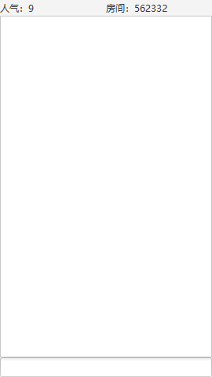

= Bilibili 应用程序接口分析

:author: Cciradih
:email: <mountain@cciradih.top>
:sectanchors:
:sectlinks:
:sectnums:
:sectnumlevels: 5
:toc:
:toc-title: 目录
:toclevels: 5
:appendix-caption: 附录
:source-highlighter: highlightjs

部分资料来自于网络。

[abstract]
== 摘要

Bilibili 应用程序接口分析，包括用户信息、二维码登录和直播弹幕收发。

[preface]
== 前言

由于作者更习惯于文字沟通，但官方直播姬并没有提供一个主播发送弹幕的功能，这是这个项目创立的初衷。本文忽略部分程序的具体实现，着重分析如何与 Bilibili 交互。

当然本仓库本身即可编译运行，主要界面如下：

[glossary]
== 术语

有效 Cookie

SESSDATA:: 登录认证数据
bili_jct:: CSRF 令牌

== HTTP

=== 用户

==== 获取信息

判断 SESSDATA 是否有效。

===== HTTP Request

[source,http]
----
GET /xlive/web-ucenter/user/get_user_info HTTP/1.1
Host: api.live.bilibili.com
Cookie: SESSDATA={SESSDATA}
----

===== HTTP Response

[source,json]
----
{
    "code": 0,
    "message": "0",
    "ttl": 1,
    "data": {
        "uid": 2078718,
        "uname": "Cciradih",
        "face": "https://i1.hdslb.com/bfs/face/8e88d34fe348d528b21462301412dfa84ac221ac.jpg",
        "billCoin": 0.9,
        "silver": 696,
        "gold": 0,
        "achieve": 255,
        "vip": 0,
        "svip": 0,
        "user_level": 21,
        "user_next_level": 22,
        "user_intimacy": 5173584,
        "user_next_intimacy": 8000000,
        "is_level_top": 0,
        "user_level_rank": ">50000",
        "user_charged": 0
    }
}
----

=== 二维码登录

==== 获取地址

获取的地址用于生成二维码；获取的 oauthKey 在后面用来轮询请求是否登录成功。

===== HTTP Request

[source,http]
----
GET /qrcode/getLoginUrl HTTP/1.1
Host: passport.bilibili.com
----

===== HTTP Response

[source,json]
----
{
    "code": 0,
    "status": true,
    "ts": 1563951868,
    "data": {
        "url": "https://passport.bilibili.com/qrcode/h5/login?oauthKey=3cd3a1a15c02939e12785f85ca6c8854",
        "oauthKey": "3cd3a1a15c02939e12785f85ca6c8854"
    }
}
----

==== 获取信息

使用前面获取的 oauthKey 请求是否登录成功，如果成功会得到一个地址，而这个地址里包含了有效 Cookie。

===== HTTP Request

[source,http]
----
POST /qrcode/getLoginInfo HTTP/1.1
Host: passport.bilibili.com
Content-Type: application/x-www-form-urlencoded

oauthKey%3D={oauthKey}
----

===== HTTP Response

[source,json]
----
{
    "code": 0,
    "data": {
        "url": "https://passport.biligame.com/crossDomain?DedeUserID={DedeUserID}&DedeUserID__ckMd5={DedeUserID__ckMd5}&Expires={Expires}&SESSDATA={SESSDATA}&bili_jct={bili_jct}&gourl={gourl}"
    },
    "status": true,
    "ts": 1563952272
}
----

=== 直播

==== 获取房间真实 ID

直播房间有短 ID，而真实 ID 需要请求获取。

===== HTTP Request

[source,http]
----
GET /room_ex/v1/RoomNews/get?roomid=1 HTTP/1.1
Host: api.live.bilibili.com
----

===== HTTP Response

[source,json]
----
{
    "code": 0,
    "msg": "ok",
    "message": "ok",
    "data": {
        "roomid": "5440",
        "uid": "9617619",
        "content": "7月27日-7月28日，虚拟主播冰火歌合战第二季正式开始！",
        "ctime": "2019-07-21 20:27:23",
        "status": "0",
        "uname": "哔哩哔哩直播"
    }
}
----

==== 弹幕

===== 地址

弹幕的接收有 CDN。

====== HTTP Request

[source,http]
----
GET /room/v1/Danmu/getConf HTTP/1.1
Host: api.live.bilibili.com
----

====== HTTP Response

[source,json]
----
{
    "code": 0,
    "msg": "ok",
    "message": "ok",
    "data": {
        "refresh_row_factor": 0.125,
        "refresh_rate": 100,
        "max_delay": 5000,
        "port": 2243,
        "host": "broadcastlv.chat.bilibili.com",
        "host_server_list": [
            {
                "host": "hw-bj-live-comet-04.chat.bilibili.com",
                "port": 2243,
                "wss_port": 443,
                "ws_port": 2244
            },
            {
                "host": "tx-sh3-live-comet-02.chat.bilibili.com",
                "port": 2243,
                "wss_port": 443,
                "ws_port": 2244
            },
            {
                "host": "broadcastlv.chat.bilibili.com",
                "port": 2243,
                "wss_port": 443,
                "ws_port": 2244
            }
        ],
        "server_list": [
            {
                "host": "119.3.230.113",
                "port": 2243
            },
            {
                "host": "172.81.242.32",
                "port": 2243
            },
            {
                "host": "broadcastlv.chat.bilibili.com",
                "port": 2243
            },
            {
                "host": "119.3.230.113",
                "port": 80
            },
            {
                "host": "172.81.242.32",
                "port": 80
            },
            {
                "host": "broadcastlv.chat.bilibili.com",
                "port": 80
            }
        ],
        "token": "fd_p14b6DWTP4yyqlGuq3lzKvq69q-ZKsiVmQAF7xlpIa7vBG2fslpI3Y3_1_ufrqARqviCookpSub7tLUOu4V6fYUKKHSAA"
    }
}
----

===== 发送

发送需要 SESSDATA 和 bili_jct，返回值没有什么信息，可以忽略。

====== HTTP Request

[source,http]
----
POST /msg/send HTTP/1.1
Host: api.live.bilibili.com
Cookie: SESSDATA=4dd2810a,1566544272,764f8471
Content-Type: application/x-www-form-urlencoded

color=1&fontsize=1&mode=1&msg={msg}&rnd=1&roomid={roomid}&bubble=0&csrf_token={bili_jct}&csrf={bili_jct}
----

====== HTTP Response

[source,json]
----
{
    "code": 0,
    "data": [],
    "message": "",
    "msg": ""
}
----

== WebSocket

=== 弹幕

==== 接收

接收弹幕使用的是 WebSocket，也是本文的重难点。所有的收发都会包含一个由长度16的字节数组组成的头部，例如：

[source]
----
0x00 0x00 0x00 0x00 0x00 0x10 0x00 0x00 0x00 0x00 0x00 0x07 0x00 0x00 0x00 0x00
----

.头部解析
|===
| 起始 | 偏移 | 值 | 说明
| 0 | 4 | 0x00 0x00 0x00 0x00 | 封包长度
| 4 | 2 | 0x00 0x10 | 头部长度
| 6 | 2 | 0x00 0x00 | 可忽略
| 8 | 4 | 0x00 0x00 0x00 0x07 | 操作码
| 12 | 4 | 0x00 0x00 0x00 0x00 | 可忽略
|===

.操作码解析
|===
| 值 | 说明
| 2 | 发送心跳
| 3 | 接收心跳与人气
| 5 | 接收弹幕
| 7 | 客户端认证
| 8 | 服务器认证
|===

===== 地址

可由 https://github.com/cciradih/tanmu/blob/master/analysis-of-the-bilibili-application-programming-interface.adoc#%E5%9C%B0%E5%9D%80[1.3.2.1.
地址] 获取。

===== 认证

建立连接的时候需要提交认证。

====== WebSocket Request

请求头::

[source]
----
0x00 0x00 0x00 0x00 | 0x00 0x10 | 0x00 0x00 | 0x00 0x00 0x00 0x07 | 0x00 0x00 0x00 0x00
----

请求体::

[source]
----
"{\"uid\":0,\"roomid\":\"{roomid}\"}".getBytes(); // uid 为0代表匿名观众，roomid就是房间 ID，可由 1.3.1. 获取房间真实 ID 获取。
----

====== WebSocket Response

响应头::

[source]
----
0x00 0x00 0x00 0x10 | 0x00 0x10 | 0x00 0x00 | 0x00 0x00 0x00 0x08 | 0x00 0x00 0x00 0x00
----

响应体::

[source]
----
N/A // 没有响应体
----

===== 心跳

====== WebSocket Request

请求头::

[source]
----
0x00 0x00 0x00 0x1F | 0x00 0x10 | 0x00 0x00 | 0x00 0x00 0x00 0x02 | 0x00 0x00 0x00 0x00
----

请求体::

[source]
----
"[object Object]".getBytes(); // 固定 [object Object] 字符串。
----

====== WebSocket Response

请求头::

[source]
----
0x00 0x00 0x00 0x14 | 0x00 0x10 | 0x00 0x00 | 0x00 0x00 0x00 0x03 | 0x00 0x00 0x00 0x00
----

请求体::

[source]
----
0x00 0x00 0x00 0x00 // 0 人气
----

===== 接收

====== WebSocket Response

请求头::

[source]
----
0x00 0x00 0x01 0x21 | 0x00 0x10 | 0x00 0x00 | 0x00 0x00 0x00 0x05 | 0x00 0x00 0x00 0x00
----

请求体::

[source]
----
123, 34, 99, 109, 100, 34, 58, 34, 68, 65, 78, 77... // {"cmd":"DANMU_MSG","info":[[0,1,25,16777215,1563956057,1,0,"4f0f9449",0,0,0],"Test SR",[2078718,"Cciradih",...
----

[dedication]
== 感谢

- https://github.com/Numeration[Numeration 的 GitHub]

[bibliography]
== 引用

* https://github.com/cciradih/tanmu/blob/master/README.adoc[檀木]

[appendix]
== 许可

* 源码采用 https://www.gnu.org/licenses/gpl-3.0.zh-cn.html[GNU 通用公共许可证] 进行许可。
* 作品采用 https://creativecommons.org/licenses/by-nc-sa/4.0/[知识共享署名-非商业性使用-相同方式共享 4.0 国际许可协议] 进行许可。

[colophon]
== 版权

© 2016 - 2019 Cciradih.top love with Aroma.
